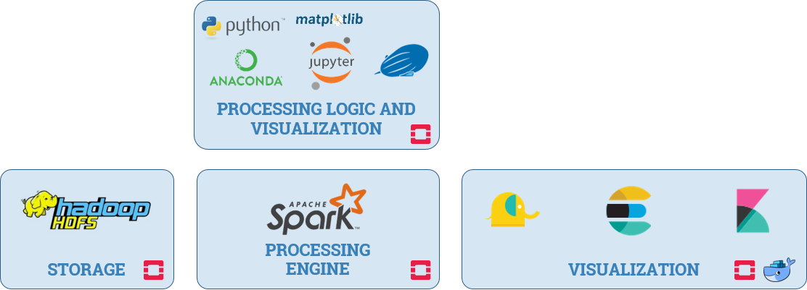
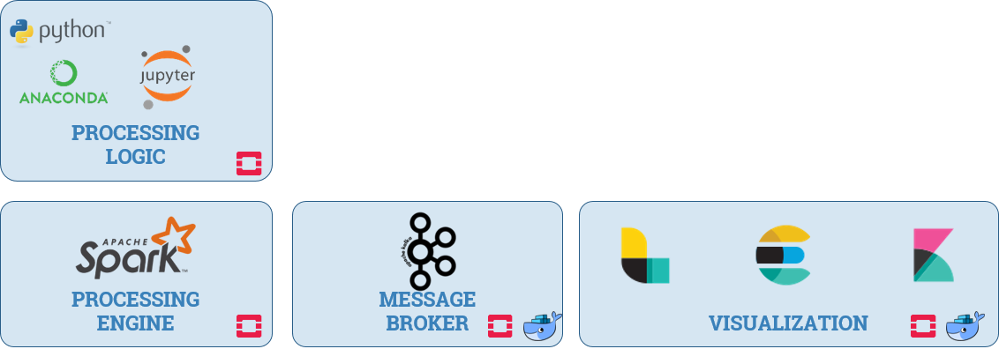

# Call Detail Records (CDR) Analysis

* Master’s Thesis
* [Master in Data Science](http://www.masterdatascience.es/), Universidad Rey Juan Carlos
* Academic Year: 2017-2018
* **Miguel-Angel Monjas**

This project meets the need to analyze a large dataset containing six month’s Call Detail Records from a small European telecommunications operator, Operator X, when no analysis infrastructure is previously available. Thus, before any analysis task is executed, an HDFS/Spark cluster is set up to enable data storage and data processing, which is executed by means of Python notebooks. Elastic Stack is deployed and used for visualization. Finally, a Kafka message broker is deployed as well in order to enable real-time use cases.

### Technology selection
Technology selection is driven by requirements but also by budget, by competence, and by personal preferences. In this project, the following technologies are thoroughly used:
* ***[Apache Hadoop (2.7.2)](http://hadoop.apache.org/docs/r2.7.4/)*** enables massive storage (HDFS) on commodity hardware and provides also a resource manager for clusters: YARN. The project input datasets and outcomes will be persisted in the HDFS cluster.
* ***[Apache Spark (2.0.2)](https://spark.apache.org/releases/spark-release-2-0-2.html)*** is the processing engine used for carrying out analysis task on the dataset. At least, one cluster configuration will be tested: Standalone. YARN will be considered if time is available. In any case, HSFS and Spark will run on the same cluster.
* Apache Spark applications are run interactively by means of ***Python 2.7*** notebooks via ***Jupyter***. Inline visualization is based on ***matplotlib***. If time is available, ***[Zeppelin (0.7.2)](https://zeppelin.apache.org/docs/0.7.2/)*** will be also tested. Python and its packages and associated functionalities are handled by means of the ***[Anaconda Distribution 4.4](https://www.anaconda.com/distribution/) for Python 2.7***. Some additional Python packages are also used:
  * ***[findspark](https://github.com/minrk/findspark)*** (a Python module that allows to call PySpark from any Python script; as we plan to trigger notebook execution by running the pyspark command, it is not actually needed);
  * ***[seaborn](https://seaborn.pydata.org/)*** is used to enhance visualization in notebooks;
  * the necessary packages to save notebooks as PDF files.
* The ***[Elastic Stack](https://www.elastic.co/products)*** (Elasticsearch/Kibana/Logstash) (5.6.1) will be used for the visualization of the cell loads in both static and dynamic scenarios.
* ***[Apache Kafka (0.8)](https://kafka.apache.org/)*** is a  message broker used in the simulation of the congestion scenario. On one hand, to dispatch communication events (start/stop) to the Spark Streaming applications. On the other, to deliver the results of the dynamic computation of cell load to the Elastic Stack (via Logstash).
* ***[Docker Community Edition (CE)](https://www.docker.com/community-edition)*** and ***[Docker Compose](https://docs.docker.com/compose/)*** will be used to deploy Apache Kafka and the Elastic Stack.

The static scenario is described by the figure below:

The dynamic scenario is described by the figure below:

The project comprises the following deliverables:
* The actual [master's thesis](./Masters_thesis_Miguel-Angel_Monjas_v1.02.docx).
* The [documentation associated to the infrastructure deployment](./doc/infrastructure.md), as a folder of this repo.
* The `elastic` folder in this repo which stores all outcomes related to the Elastic Stack functionalities: Elasticsearch indices, Logstash filters, Kibana objects (visualizations and dashboards).
* `docker-elastic`, a submodule of this repo, which provides the Docker-related files needed to launch the Elastic Stack components.
* `master-thesis-notebooks`, a private submodule of this repo. It is private as it contains confidential information. 