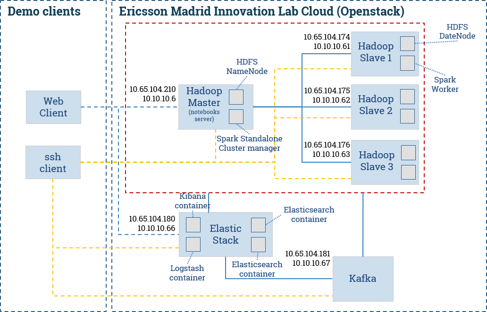
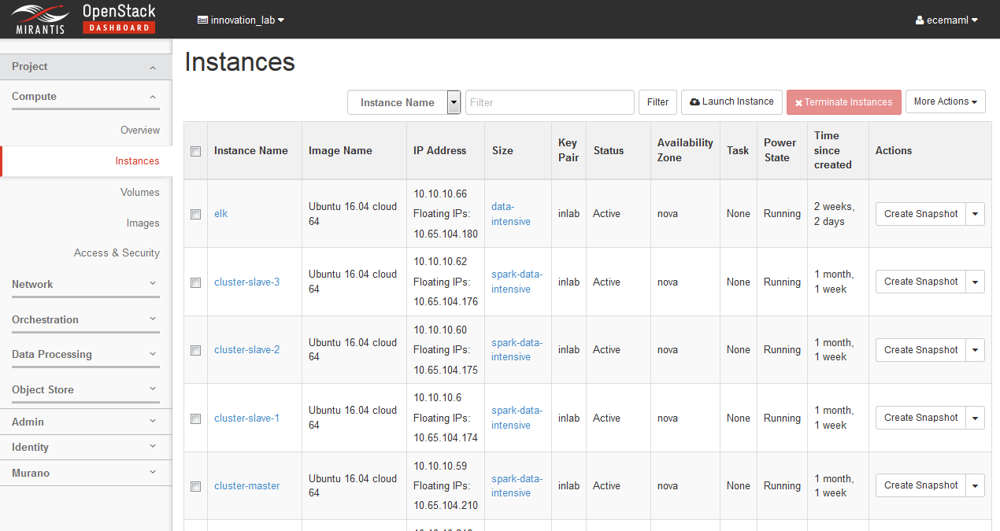

# Environment description
The project aims to analyze a large amount of data (about 300 GB with about 55 million records) and therefore will require the setup of an HDFS cluster (to handle storage) and a Spark cluster, for processing it. Additionally, there will be dedicated instances for visualization (a node hosting an [Elastic Stack](https://www.elastic.co/webinars/introduction-elk-stack)) and for running the clients (clients will be based on notebooks): Jupyter and Zeppelin.

* [Instance creation](#instance-creation)
* [See also](#see-also)

----

## Instance creation
The project will rely on a private [Openstack](https://www.openstack.org/) cloud. The main reason not to use a public cloud provider lies in the confidential nature of the data to be analyzed. For privacy reasons it is not possible to transfer said data to other entities and therefore, in-house means have to be used.

The project will create the following instances:
* [Four instances for the HDFS/Spark cluster](#cluster-instances): one master and three slaves. The master instance will host only "master" processes: the HDFS cluster *NameNode* and the Spark cluster *Master* (no *Worker* or *DateNodes*). The master will run also the Spark *Driver*, and a notebooks server as well.
* [One instance for hosting a Docker Elastic Stack container](#elastic-stack-instance).
* [One instance for hosting a Docker Kafka container](#kafka-instance).

As with any other cloud-based solution, instances in Openstack are assigned an authentication key on creation so that no need to provide credentials at login is needed. Instead, ssh-based login by means of a private key available at the client is enabled. These keys are assigned to the user `ubuntu`. This default user has `sudo` privileges as well.

### HDFS/Spark Cluster instances
Four instances will be created, with the following hostnames `cluster-master`, `cluster-slave-1`, `cluster-slave-2` and `cluster-slave-3`. The OS used is Ubuntu 16.04 and the flavor (`spark-data-intensive`) has the following features:
* **Memory**: 32 GB
* **vCPU**: 16

Each instance is given a private IP address, `<master-ip-address>`, `<slave-1-ip-address>`, `<slave-2-ip-address>` and `<slave-3-ip-address>`. A floating IP address must be manually assigned to each instance: `<master-floating-ip-address>` (slave instances are also assigned floating IP addresses, as it eases debugging; otherwise, access would be only possible through the master instance, by means of ssh connections).

### Elastic Stack instance
A single instance will be created, with the following hostname: `elk`. The OS used is again Ubuntu 16:04 and the flavor (`data-intensive`) provides the following features:
* **Memory**: 16 GB
* **vCPU**: 4

It is given a private IP address: `<elastic-ip-address>` and a floating IP address, `<elastic-floating-ip-address>` as well. Otherwise, it will not be possible to access Kibana to visualize the information stored in Elasticsearch.

### Kafka instance
An instance with similar configuration to that of the Elastic Stack instance is created, with the following hostname: `kafka`. This instance is given a private IP address: `<kafka-ip-address>` and a floating IP address, `<kafka-floating-ip-address>` as well.
________________

To ease host name handling, the private IP addresses of all the instances is mapped to a meaningful host name in the `/etc/hosts` file in each instance: `cluster-master`, `cluster-slave-1`, `cluster-slave-2`, `cluster-slave-3`, `elk` and `kafka`.

The list of instances can be seen in the Openstack UI:

## See also
* [Infrastructure deployment index](./infrastructure.md)
* [Setting up an HDFS cluster](./hadoop-cluster-setup.md).
* [Running a Standalone Spark cluster](./spark-standalone-cluster-setup.md).