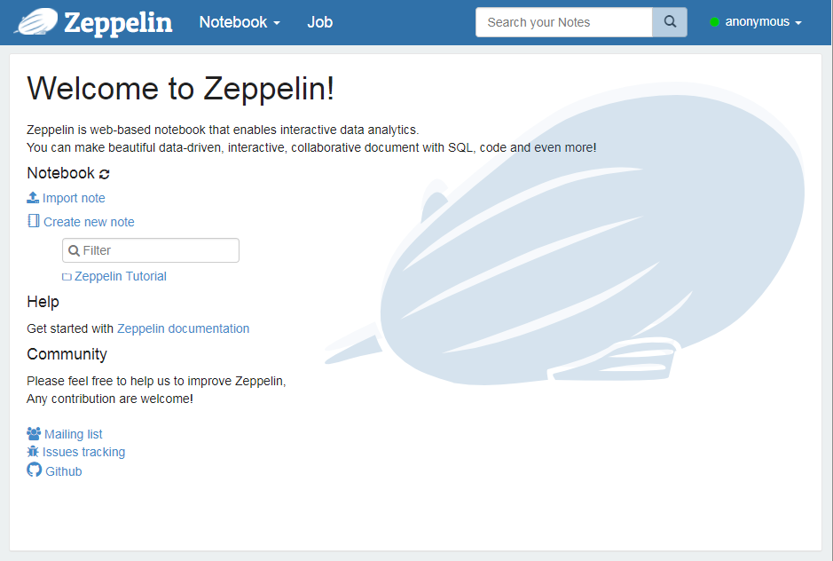

# Running Zeppelin notebooks on a Spark Standalone cluster
Apache Zeppelin is another web-based Notebook that supports a variety of languages and back-end technologies. It is especially useful the possibility to combine several languages y a same notebook (for instance, `shell` to run HDFS commands and `python` to execute tasks on `pyspark`). However, the last available release when compiling this guide ([Zeppelin 0.7.2](https://zeppelin.apache.org/docs/0.7.2/install/install.html)) does not support Spark 2.2.*. This is the main reason not to use the more recent Spark version.

* [Pre-requisites](#pre-requisites)
* [Zeppelin installation](#zeppelin-installation)
* [Zeppelin environment variables setup](#zeppelin-environment-variables-setup)
* [Additional Zeppelin configuration](#additional-zeppelin-configuration)
* [Notebook start and stop](#notebook-start-and-stop)
* [See also](#see-also)


----
## Pre-requisites
Anaconda's Python 2.7 is installed according to the procedure described in [Running Jupyter notebooks on a Spark Standalone cluster](./jupyter-setup.md) on the master and slave instances.

## Zeppelin installation
A node to run Zeppeling must be chosen (belonging or not to the cluster). Zeppelin will be installed in said instance:

```bash
wget http://apache.rediris.es/zeppelin/zeppelin-0.7.2/zeppelin-0.7.2-bin-all.tgz
tar -zxvf zeppelin-0.7.2-bin-all.tgz
sudo mkdir -p /opt/zeppelins
sudo mv zeppelin-0.7.2-bin-all /opt/zeppelins/zeppelin-0.7.2-bin-all
sudo ln -s /opt/zeppelins/zeppelin-0.7.2-bin-all /usr/local/zeppelin
rm zeppelin-0.7.2-bin-all.tgz
```

## Zeppelin environment variables setup
The following environment variables are set in the `.bashrc` file under `/home/ubuntu` (on the instance where Zeppelin has been installed):
```bash
echo '
# Set ZEPPELIN_HOME
export ZEPPELIN_HOME=/usr/local/zeppelin
# Set ZEPPELIN_CONF_DIR
export ZEPPELIN_CONF_DIR=$ZEPPELIN_HOME/conf
# Add Zeppelin bin directory to PATH
export PATH=$PATH:$ZEPPELIN_HOME/bin
' >> ~/.bashrc
```

The `.bashrc` file is reloaded:
```bash
source ~/.bashrc
```

## Additional Zeppelin configuration
Zeppelin must be configured to make it seamlessly work with the cluster defined in previous sections:
* The default port where the Zeppelin notebook is exposed is 8080. It creates a conflict with the Spark cluster UI.
* Jupyter and Zeppelin notebooks should be saved in the same location.
* Spark configuration (see [here](https://zeppelin.apache.org/docs/0.7.2/interpreter/spark.html)).

There are several locations where Zeppelin can be configured. One of them is by inserting environment variables in `$ZEPPELIN_CONF_DIR/zeppelin-env.sh` (the file must be created first). Default values can be found [here](https://zeppelin.apache.org/docs/0.7.2/install/configuration.html).

```bash
cp $ZEPPELIN_CONF_DIR/zeppelin-env.sh.template $ZEPPELIN_CONF_DIR/zeppelin-env.sh
sed -i "s@# export SPARK_HOME@export SPARK_HOME=$SPARK_HOME@" $ZEPPELIN_CONF_DIR/zeppelin-env.sh
sed -i "s/# export MASTER=/export MASTER=spark:\/\/cluster-master:7077/" $ZEPPELIN_CONF_DIR/zeppelin-env.sh
sed -i "s/# export ZEPPELIN_NOTEBOOK_DIR/export ZEPPELIN_NOTEBOOK_DIR=\/home\/ubuntu\/notebooks/" $ZEPPELIN_CONF_DIR/zeppelin-env.sh
echo "
# set Hadoop conf dir
export HADOOP_CONF_DIR=$HADOOP_CONF_DIR
# set Zeppelin server port
export ZEPPELIN_PORT=8180
" >> $ZEPPELIN_CONF_DIR/zeppelin-env.sh
```

## Notebook start and stop
Verification of a right Zeppelin installation can be done by typing `$ZEPPELIN_HOME/bin/zeppelin-daemon.sh start`. Next, go to `http://<zeppelin-node-ip-address>:8180/` with a web browser. The result should be similar to this:



To stop it, type `$ZEPPELIN_HOME/bin/zeppelin-daemon.sh stop`

## See also
* [Running Jupyter notebooks on a Spark Standalone cluster](./jupyter-setup.md)
